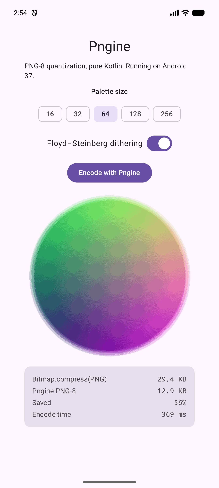

# Sample app

[`sample/`](https://github.com/OneDroid/pngine/tree/main/sample) is a Compose
Multiplatform app — Android, iOS, desktop and web — that generates a test
image, encodes it with Pngine, and reports what it saved.

{ width="320" }

The demo image is a two-axis colour gradient behind a soft-edged disc, so it
exercises both dithering (gradients band badly under naive quantization) and
alpha (the disc's edge is partially transparent).

## What it shows

- A palette-size selector and a dithering toggle, wired to `PngineOptions`
- The encoded PNG-8, decoded and drawn back
- Output size against the platform's own PNG encoder, and the encode time

Measured at 64 colours:

| Target | Pngine PNG-8 | Platform PNG | Encode |
| --- | --- | --- | --- |
| Android emulator (Pixel 10 Pro XL) | 12.9 KB | 29.4 KB | 369 ms |
| Web (Wasm, Chrome) | 12.8 KB | — | 73 ms |

## How it depends on Pngine

The sample is a separate Gradle build that pulls the library in as a
composite build:

```kotlin title="sample/settings.gradle.kts"
includeBuild("..")
```

The dependency itself sits in `commonMain`, because there is nothing
platform-specific to work around:

```kotlin title="sample/shared/build.gradle.kts"
commonMain.dependencies {
    implementation(libs.pngine)
}
```

The only `expect`/`actual` in the sample is `PlatformPng`, which fetches the
platform's own 32-bit PNG encoder purely as a size baseline —
`Bitmap.compress` on Android, `ImageIO` on desktop, nothing on iOS or web.

## Running it

```bash
cd sample
```

| Target | Command |
| --- | --- |
| Android | `./gradlew :androidApp:installDebug` |
| Desktop | `./gradlew :desktopApp:run` |
| Web (Wasm) | `./gradlew :webApp:wasmJsBrowserDevelopmentRun` |
| Web (JS) | `./gradlew :webApp:jsBrowserDevelopmentRun` |
| iOS | open `iosApp/iosApp.xcodeproj` in Xcode and run |
